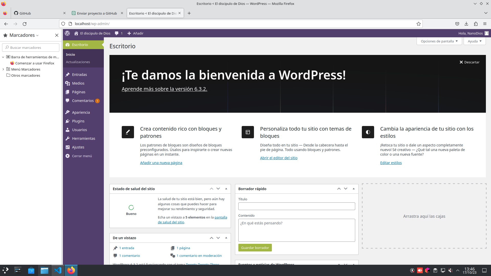

# Trabajando en WordPress

#### 1. Creo un directorio en mi sistema donde configuro el entorno de WordPress.

#### 2. En el directorio recién creado, creo un archivo llamado docker-compose.yml.

#### 3. Agrego la configuración de WordPress y MySQL a docker-compose.yml, remplazando la contraseña del root , usuario y contraseña con los valores deseados.

#### 4. inicio el contenedor

#### 5. Accedo al wordpress desde un navegador con 'http://localhost:80'

## CAPTURA DENTRO DE WORDPRESS

